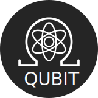

[![Contributors][contributors-shield]][contributors-url]
[![Forks][forks-shield]][forks-url]
[![Stargazers][stars-shield]][stars-url]
[![Issues][issues-shield]][issues-url]
[![MIT License][license-shield]][license-url]

 

  

  

    Discord bot for boolean beans server, using Pycord.
     
    <a href="https://github.com/boolean-beans/qubit"><strong>Explore the docs »</strong></a>
     
     
    <a href="https://github.com/boolean-beans/qubit">View Demo</a>
    ·
    <a href="https://github.com/boolean-beans/qubit/issues">Report Bug</a>
    ·
    <a href="https://github.com/boolean-beans/qubit/issues">Request Feature</a>
  

## Overview

(<a href="#top">back to top</a>)

Work in progress, come back later

### Built With

- [Docker](https://docs.docker.com/)
- [Docker Compose](https://docs.docker.com/compose/)
- [SQLAlchemy 1.4.28](https://docs.sqlalchemy.org/en/14/) 
- [PostgreSQL 14.1](https://www.postgresql.org/docs/14/)
- [Pydantic 1.8.2](https://pydantic-docs.helpmanual.io/)
- [Pycord](https://github.com/Pycord-Development/pycord)

## License

Distributed under the GPLv3 License. See `LICENSE` for more information.

(<a href="#top">back to top</a>)

[contributors-shield]: https://img.shields.io/github/contributors/boolean-beans/qubit.svg?style=for-the-badge
[contributors-url]: https://github.com/boolean-beans/qubit/graphs/contributors
[forks-shield]: https://img.shields.io/github/forks/boolean-beans/qubit.svg?style=for-the-badge
[forks-url]: https://github.com/boolean-beans/qubit/network/members
[stars-shield]: https://img.shields.io/github/stars/boolean-beans/qubit.svg?style=for-the-badge
[stars-url]: https://github.com/boolean-beans/qubit/stargazers
[issues-shield]: https://img.shields.io/github/issues/boolean-beans/qubit.svg?style=for-the-badge
[issues-url]: https://github.com/boolean-beans/qubit/issues
[license-shield]: https://img.shields.io/github/license/boolean-beans/qubit.svg?style=for-the-badge
[license-url]: https://github.com/boolean-beans/qubit/blob/master/LICENSE.txt
